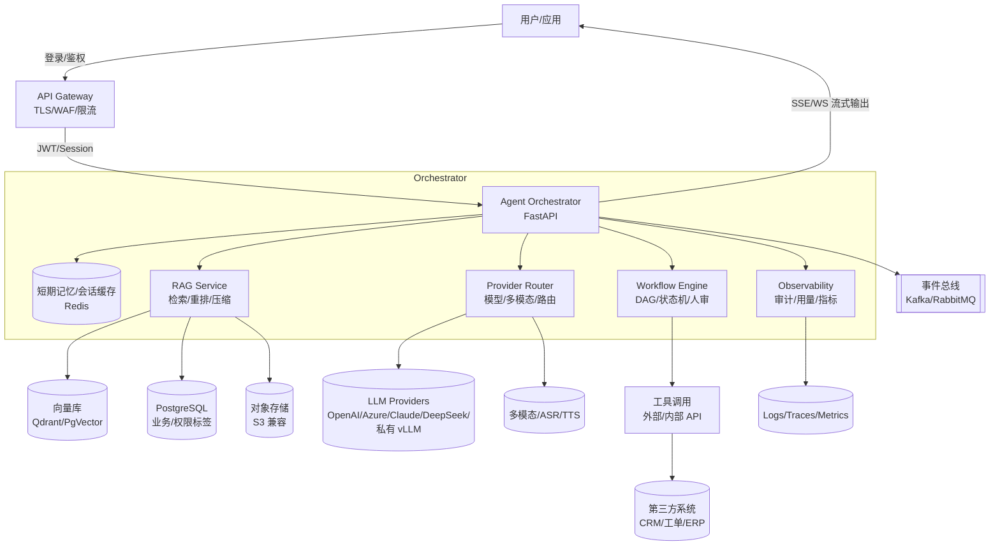

# AI Agent 平台架构设计（FastAPI + Next.js）

## 1. 目标与定位
- **业务目标**: 面向企业内部与 SaaS 场景，构建可插拔、多智能体协作、可审计与可控的 AI Agent 平台，覆盖问答检索、流程自动化、业务工单处理、数据分析与生成式创作等高频场景。
- **核心能力**: 工具编排（Function Calling）、知识 RAG、多智能体协作（Plan/Reflect/Critic）、工作流编排、可观测与安全合规、插件生态、低代码配置。
- **SLO**: P95 首次字节 < 2.5s；多轮任务成功率 > 85%；错误可追踪率 100%；数据隔离 100%。

## 2. 整体架构概览
- **前端（Next.js 14，App Router）**
  - 渲染：SSR/ISR 混合；会话/Agent 运行面板采用流式 SSE/WS。
  - 组件库：采用 Ant Design 设计语言（React 实现），配色遵循：黑/白基色、iOS Gray 次级文本、系统蓝 #007AFF 用于关键动作/标题；不使用多余拟物化图标。
  - 模块：登录与组织、Agent 市场、会话与任务看板、知识库、工具与密钥、观测与审计、计费与配额。
- **后端（FastAPI）**
  - API 分层：Gateway（Auth/限流/灰度）→ Orchestrator（会话、智能体、工作流、工具路由）→ Providers（LLM/多模态/检索/向量/三方 API）→ Infra（存储/队列/缓存/日志/审计）。
  - 通信：HTTP + SSE/WS；内部异步任务 Celery/RQ；事件总线 Kafka/RabbitMQ（推荐 Kafka）。
- **数据与基础设施**
  - 存储：PostgreSQL（业务/审计/配置），Redis（会话缓存、速率限制），S3 兼容对象存储（文件/快照）。
  - 向量：Qdrant（生产推荐）或 PgVector（一体化轻量）。
  - 观测：OpenTelemetry + Tempo/Jaeger（Trace），Prometheus + Grafana（Metrics），ELK/ClickHouse（Logs/Analytics）。
  - 部署：Kubernetes（蓝绿/金丝雀），Ingress/Nginx，CI/CD（GitHub Actions），配置集中 `.env`/Vault。

## 3. 端到端流程图（Mermaid）

## 4. 核心域与职责
### 4.1 Agent Orchestrator
- 会话状态机：消息 → 工具调用 → 记忆写入 → 评审纠偏 → 流式输出。
- 多智能体：Planner/Worker/Critic/Memory 角色化，链路可回放与观察。
- 工具体系：JSON Schema 注册、参数校验、幂等/熔断/重试、权限沙箱、审计与成本记录。

### 4.2 RAG & 知识库
- 导入渠道：本地、S3、Notion/Confluence/GDrive；解析（文本/表格/图片+OCR）、自适应语义分块。
- 检索策略：BM25 + 向量混检 → Cross-Encoder 重排 → 上下文压缩（答案相关片段抽取）。
- 权限模型：行级/文档级标签，租户隔离，私密文档不越权泄露。

### 4.3 Workflow 引擎
- 节点类型：LLM、工具、条件、循环、汇聚、等待、人机协同（审批）。
- 可靠性：失败重试与补偿；版本化与回放，参数/上下文快照。

### 4.4 Provider Router
- 多云/多模型：OpenAI/Azure/Claude/DeepSeek/私有 vLLM。
- 路由策略：按成本/延迟/可用性/配额；支持熔断与降级（JSON Mode/Tool 优先）。
- 多模态：语音识别/合成、图像理解、结构化提取。

### 4.5 安全合规
- DLP、敏感词与越权检测、提示注入防护（规则+模型）。
- RBAC/ABAC：到资源/字段/工具级；高危工具二次确认。
- 审计：事件不可篡改、长期留存、可检索回放。

## 5. 数据模型（核心表）
- 身份与租户：`User`、`Org`、`Membership`、`RolePolicy`、`APIKey`
- Agent 与编排：`Agent`、`AgentVersion`、`Tool`、`ToolBinding`、`Workflow`、`WorkflowRun`、`NodeRun`
- 会话与记忆：`Conversation`、`Message`、`FunctionCall`、`Memory`、`Attachment`
- 知识库与索引：`KnowledgeBase`、`Document`、`Chunk`、`Embedding`、`IndexJob`
- 观测与计费：`AuditEvent`、`SafetyIncident`、`CostUsage`、`ProviderConfig`、`RoutingPolicy`

## 6. 关键接口边界（代表性）
- Auth：`/auth/login`、`/auth/callback`、`/auth/refresh`
- Agent：`/agents`（CRUD）、`/agents/{id}/run`（SSE）、`/agents/{id}/tools`
- Tool：`/tools`（CRUD）、`/tools/test`、`/tools/{id}/invoke`
- Conversation：`/conversations`（CRUD）、`/conversations/{id}/messages`（SSE）
- Workflow：`/workflows`（CRUD）、`/workflows/{id}/run`、`/workflows/{id}/replay`
- KB：`/kb`（CRUD）、`/kb/{id}/documents`、`/kb/{id}/reindex`
- Observability：`/metrics`、`/traces`、`/audits`
- Billing：`/usage`、`/quota`、`/costs`

## 7. 关键交互流程
### 7.1 会话推理（SSE）
1) 前端发起会话（带用户/租户上下文） → 2) Gateway 鉴权与限流 → 3) Orchestrator 装配短期记忆与系统提示 → 4) 触发 RAG 检索/重排/压缩（按权限标签过滤） → 5) Provider Router 选择合适模型（带熔断/降级） → 6) LLM 推理（可能触发多次工具调用与并发窗口）→ 7) Critic 评审与修正 → 8) 流式回传给前端（SSE/WS）→ 9) 写入审计、用量与记忆。

### 7.2 工作流运行
- DAG 调度节点，失败重试与补偿；人工审批节点阻塞继续；运行完成产出工件与指标，可回放与参数替换。

## 8. 非功能与治理
- **性能与扩展**：流式优先、幂等键、工具并发窗口、热路由与预热缓存、长任务异步与进度事件流、断线重连。
- **可靠性**：重试/退避、熔断隔离、限流/配额闸门、幂等落库；蓝绿/金丝雀、自动回滚（探针失败/SLI 退化）。
- **可观测**：端到端 Trace、结构化日志关联 ID、业务指标（成功率/时延/成本）看板；评测与 AB（检索质量/提示策略）。
- **安全合规**：多层防护（WAF→鉴权→DLP/注入→沙箱）、数据驻留/最小化、删除与导出、密钥分权与轮换。

## 9. 前端应用设计（Next.js）
- 技术：App Router、Server Actions；SSE/WS 流式渲染；React Query/Server Components 混合数据获取。
- 设计语言与配色：黑/白基色，iOS Gray 用于次级文本，系统蓝 #007AFF 用于关键动作或标题；避免不必要的拟物化图标。
- 关键页面：控制台（延迟/成功率/成本）、会话与工作流（多智能体可视化、节点详情、人工介入/复盘）、知识库（索引状态/检索评测）、工具与密钥（Schema/分权）、审计与安全（会话回放/拦截事件）、计费与配额。

## 10. DevOps 与发布
- 环境：dev/staging/prod；配置集中 `.env` + Secrets Manager/Vault；灰度发布（按租户/用户特征）。
- CI：代码扫描（ruff/flake8、eslint）、单测（pytest/jest）、合成测试（playwright）、安全扫描（trivy）。
- CD：镜像构建（多阶段），K8s 部署（Helm），自动回滚（探针失败/指标退化）。

## 11. 里程碑规划
- M1 基线（4-6 周）：单 Agent + 工具调用 + 基础 RAG + 流式会话 + 观测/审计 + 简单计费。
- M2 专业（6-10 周）：多 Agent 协作 + 工作流引擎 + 路由/熔断 + 评测/AB。
- M3 企业（>10 周）：SAML/SCIM、精细化 RBAC/ABAC、数据驻留、审批流与插件生态。

## 12. 阅读与预览说明
- 本文档为 Markdown，流程图使用 Mermaid 语法：
  - GitHub/GitLab 原生渲染支持；本地可通过 VSCode 安装 "Markdown Preview Mermaid Support" 插件预览。
  - 也可使用 `https://mermaid.live` 在线预览。
- 后续如需拆分为多文档，请保留本文件为总纲，并将模块细节置于 `docs/` 目录下（例如 `docs/orchestrator.md`、`docs/rag.md`）。
